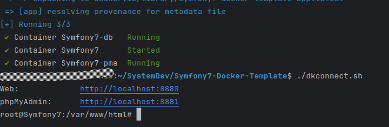

# Symfony7 Docker Template

🚀 **Quickly set up your Symfony 7 application with Docker!**

## Features

- Pre-configured Symfony 7 application
- Easy configuration through a customizable `docker.env` file.
- Pre-defined scripts for building and connecting to your Docker containers.
- Seamless integration with [phpMyAdmin](https://www.phpmyadmin.net/) for database management.

## Getting Started

1. Open the file `docker.env` and customize any of the environment variables to your needs. You may change the `DC_*`
   values in order to avoid container conflicts with already running containers.

    ```shell
    # Container name for the app service in docker-compose.yaml, must be unique for all containers running on your docker instance
    DC_APP_NAME=Symfony7
    # Forwarded port for the Symfony7 app service
    DC_APP_PORT=8880
    # Forwarded port for phpMyAdmin service to view the underlying application database
    DC_PMA_PORT=8881
    # MySQL credentials - username
    MYSQL_USER=app_development
    # MySQL credentials - password
    MYSQL_PASSWORD=password
    # MySQL credentials - database
    MYSQL_DATABASE=app_db
    ``` 

4. Once you have successfully configured your app via the `docker.env` file, run the `./dkbuild.sh` file to build your
   container images and run the application.
5. Next, run `./dkconnect.sh` to connect to the `app` service container where the *Symfony7* application is running.

   

6. Run `symfony composer install` to install the application and it's dependencies.

   

## Where to Next?

Congratulations on getting to this point. When you run `./dcconnect.sh` you will be shown the two URLs that you may use
to access the application and the database (via phpMyAdmin).


Inside the container, you may run any `symfony console` or `php bin/console` command as you build your application. Any
changes you make in this container are
immediately visible in your IDE and vice versa.

Happy coding! 🎉

